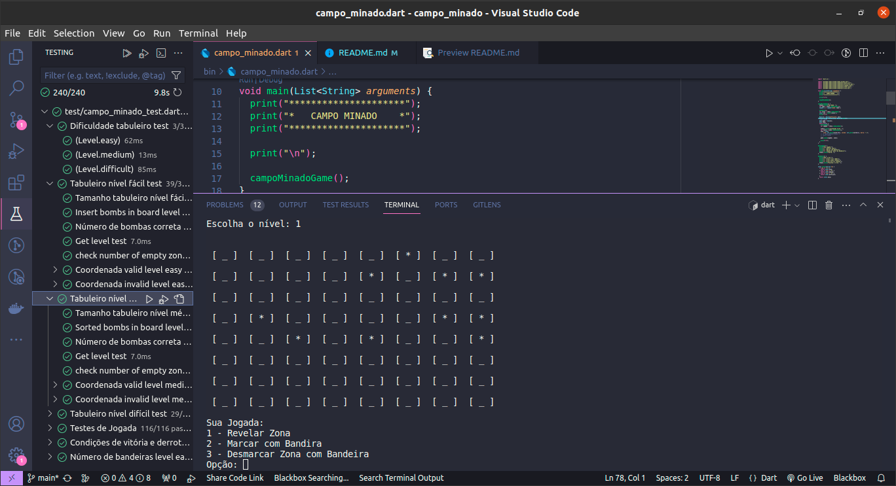

# Campo Minado
Implementação do jogo campo minado em Dart com testes para a disciplina de Tópicos especiais II.
- Objetivo: Criar o jogo campo minado utilizando a técnica de TDD (Test Driven Development).

## Requisitos
- As regras do jogo são simples: O jogador deve marcar com uma bandeira todos as zonas que ele
imaginar conter uma bomba. O jogador só tem três ações possíveis: (i) colocar uma bandeira em
uma zona indicando que a mesma contém uma bomba, (ii) remover uma bandeira previamente colocada ou (iii) e descobrir uma zona sem bandeira. Não é possível descobrir uma zona com bandeira, é necessário remover uma bandeira antes de descobri-la. Não é possível cobrir uma zona depois de descobri-la. Todas as zonas iniciam cobertas e sem bandeira. Cada zona pode ser área limpa ou conter uma bomba. As zonas limpas que fazem fronteira com zonas com bomba, indicam quantas bombas aparecem adjacentes a ela. Cada zona pode ter de zero (0) a oito (8) zonas que contém bomba adjacentes a ela. A quantidade de bombas adjacentes a uma zona é revelada ao descobri-la. O jogador vence se descobrir todas as zonas contendo bomba, sem explodir nenhuma. Uma bomba explode se o jogador descobrir a zona que ela se encontra. A pontuação do jogo é dada pelo tempo levado para descobrir todas as bombas em segundos. O número de bombas é fixo a cada partida nível jogado. Considere três graus de dificuldade, dados pelas dimensões do tabuleiro e a densidade de bombas espalhadas no campo: fácil (8x8 – 10 bombas); intermediário (10x16 – 30 bombas); e difícil (24x24 – 100 bombas). Mantenha uma histórico de resultados para consulta.

## Separação de Requistos
* Requisitos Funcionais
    * Nível do Tabuleiro:
        - Fácil
        - Médio
        - Difícil
    * Tamanho do Tabuleiro por nível:
        - (8 x 8)
        - (10 x 16)
        - (24 x 24)
    * Número de bombas por nível:
        - (8 x 8) = 10
        - (10 x 16) = 30
        - (24 x 24) = 100
    * Zonas adjacentes as bombas possuem números que indicam a quantidade de bombas ao redor
    * Ao iniciar o tabuleiro as zonas devem ser cobertas:
        - sem bomba
        - sem bandeira
    * Zonas devem conter bombas
    * Uma zona pode ter de 0 a 8 zonas com bombas adjacentes a ela
        * bombas no centro
        * bombas nas bordas do tabuleiro
        * Bombas nos cantos
    * Zonas limpas fazem fronteira com as zonas com bombas e contém números indicando a quantidade de bombas.
    * Um jogador tem três opções de jogada:
        * Descobrir zona
        * Marcar zona como Bandeira
        * Desmarcar zona com Bandeira
    * Jogador não pode abrir uma zona com bandeira
    * Jogador não pode cobrir uma zona já descoberta
    * Jogador deve remover uma bandeira antes de revelar uma bomba já marcada.
    * Jogador vence se não explodir nenhuma bomba
    Jogador vence se marcar todas as zonas que contém mina com bandeira.
    * O Jogo deve manter um histórico de partidas
        * Salvar partida no histórico
        * Pode consultar o histórico
    * No histórico deve conter:
        * Pontuação
        * Tempo da partida
        * Nível jogado
    * A pontuação deve ser o tempo  
## Casos de Teste
Nos casos de teste foram utilizados técnicas de teste de:
 * Classe de equivalência
 * análise de valor limite.


## Execução


```sh
 dart ./bin/campo_minado.dart
```

## Implemetação


## Testes
